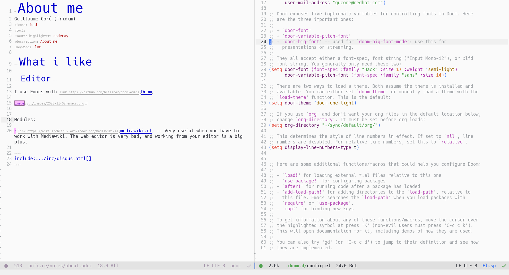

= Software i like (and use)
Guillaume Coré (fridim)
:icons: font
:toc:
:source-highlighter: coderay
:description: Software I like
:keywords: android, linux

== In bulk

* Archlinux (laptop & desktop)
* Alpine Linux (server)
* link:https://i3wm.org/[i3wm] to manage my windows
** link:https://github.com/vivien/i3blocks[i3blocks] status bar
* link:https://syncthing.net/foundation/[syncthing] to sync files
* link:https://keepassxc.org/[keepassxc] password manager
* link:https://mosh.org[Mosh (mobile shell)] instead of SSH, when you're roaming, it's a must have
* link:https://github.com/tmux/tmux[tmux]
* link:https://github.com/alacritty/alacritty[Alacritty] rust terminal that uses GPU
** shell prompt: link:https://starship.rs/[starship]
* link:https://github.com/flameshot-org/flameshot[Flameshot] screenshot software
* link:https://protonvpn.com/[protonvpn], link:https://proton.me/[proton mail]
* link:https://zerotier.com[zerotier]: zeroconf VPN for local and remote machines

=== Mobile

* link:https://www.etesync.com/[etesync] to sync contacts, calendar and tasks
* link:https://syncthing.net/foundation/[syncthing] to sync files
* link:https://play.google.com/store/apps/details?id=org.shadowice.flocke.andotp[andOTP] for everything 2FA
* link:https://play.google.com/store/apps/details?id=de.danoeh.antennapod[AntennaPod] for podcasts
* link:https://play.google.com/store/apps/details?id=com.bandcamp.android[Bandcamp] and link:https://play.google.com/store/apps/details?id=com.discogs.app[Discogs] (link:https://www.discogs.com/[web] is great too) for music
* link:https://play.google.com/store/apps/details?id=com.benshistudio[Benshi]  Vidéo pour les enfants (par âge, thème)
* link:https://play.google.com/store/apps/details?id=com.appxy.tinyscan[Tiny Scanner Pro] to scan documents from the mobile
* link:https://play.google.com/store/apps/details?id=im.vector.app[Element], link:https://play.google.com/store/apps/details?id=org.thoughtcrime.securesms[Signal] and link:https://play.google.com/store/apps/details?id=io.olvid.messenger[Olvid] for instant messaging

== Programming

* Golang

== Editor

I use Emacs with link:https://github.com/hlissner/doom-emacs[Doom] framework.

Notable modules:

* link:https://wiki.archlinux.org/index.php/Mediawiki-el[mediawiki.el] — *Very* useful when you have to work with Mediawiki. The web editor is very bad, and working from your editor is a big plus.
