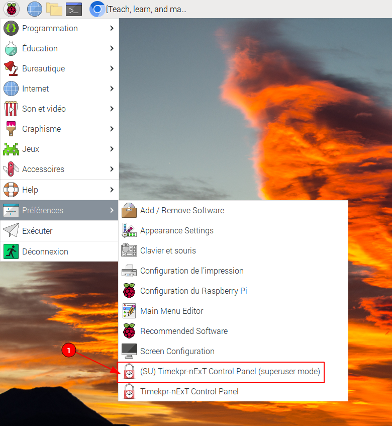
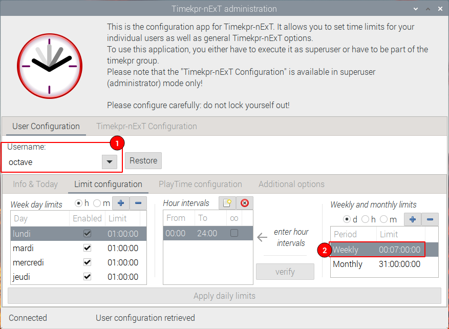

= Parental Control on a Raspberry Pi 400 =
:icons: font
:toc2:
:source-highlighter: coderay
:description: Parental Control on a Rasberry Pi 400
:keywords: parental_control proxy
:author: Guillaume Coré (fridim)

A few weeks ago, the link:https://www.raspberrypi.com/products/raspberry-pi-400/[Raspberry Pi 400] for my son's birthday arrived in the mail. It was not easy to get one, as the availability is low on those single board computers. I had my eyes on the link:https://www.pine64.org/[pine64 series] too, but for a 9yo, i figured the pi400 design would be a better fit.

So the idea is to provide him with an easy access to information. Access to knowledge is fundamental. But I want to help him not spend two hours a day on youtube or worst.

Since he is pretty young to have full access, I want to set up the Pi in a certain way:

* Only access to a few websites we, as his educators, control:
** The list can grow as he browses the web and asks for more access.
* Time limitation: only a few hours a week. He can manage his time the way he wants.
* no root (admin) access

== Hardware ==

Pi 400 comes in a bundle with a mouse, an SD card with pre-installed OS, and cables. All it needs now is an HDMI monitor.
Frankly, it looks great.

After playing with it for a couple of hours, the overall sensation is pretty good. Browsing the web is fast. The OS is Raspbian 11, bullseye Debian.

== Software ==
=== Time Control ===

That ended up being way more straightforward than I initially thought it would.
Just install: link:https://mjasnik.gitlab.io/timekpr-next/[timekpr-next]

Then configure it from the GUI. Simple as that.

.Add the admin user to the timekpr group
----
sudo gpasswd -a fridim timekpr
# relaunch X session
----

<1> Run the `timekpra` as admin

<1> Select user
<2> Define number of hours per week

=== Filtering Web access ===

To filter web access, set up TinyProxy on one of the local network machines. For me, it's an Orange Pi 4 LTS. I think it's easier if the proxy lives on a different machine than the child's computer. But it could be possible to bind it there, maybe a bit complex.
I'm using link:http://tinyproxy.github.io/[TinyProxy] because it's enough for my case, but you could use squid.

==== TinyProxy, on a separate host ====

.`/etc/tinyproxy/tinyproxy.conf`
----
User tinyproxy
Group tinyproxy
Port 8888
Timeout 600
DefaultErrorFile "/usr/share/tinyproxy/default.html" <1>
StatFile "/usr/share/tinyproxy/stats.html"
LogFile "/var/log/tinyproxy/tinyproxy.log"
LogLevel Info
PidFile "/run/tinyproxy/tinyproxy.pid"
MaxClients 100
Allow 127.0.0.1
Allow ::1
Allow 192.168.0.0/16 <2>
ViaProxyName "tinyproxy"
Filter "/etc/tinyproxy/filter"
FilterDefaultDeny Yes
ConnectPort 443
ConnectPort 563
----
<1> You can customize the HTML page
<2> Allow machines from the local network

.`/etc/tinyproxy/filter`
----
easylist.to$
ublockorigin\.github\.io$
ublockorigin\.pages\.dev$
malware-filter\.pages\.dev$
malware-filter\.gitlab\.io$
curbengh\.github\.io$

filters\.adtidy\.org$

download\.zerotier\.com$
.*\.raspberrypi\.org$
mirrors\.ircam\.fr$
distrib-coffee\.ipsl\.jussieu\.fr$

wikipedia\.org$
.*\.wikipedia\.org$
wikimedia\.org$
.*\.wikimedia\.org$

google\.com$
.*\.google\.com$
duckduckgo\.com$
easylist-downloads\.adblockplus\.org$
googleapis\.com$
.*\.googleapis\.com$
----

.Ansible playbook to quickly allow a domain
[source,yaml]
----
#!/bin/env -S ansible-playbook -i opi,
- hosts: opi
  become: true
  gather_facts: false
  vars_prompt:
    - name: domain_exp
      prompt: What is the domain Expression you want to allow?
      private: false
  tasks:
    - name: Add domain to /etc/tinyproxy/filter
      lineinfile:
        path: /etc/tinyproxy/filter
        line: "{{ domain_exp }}"

    - name: Restart tinyproxy
      service:
        name: tinyproxy
        state: restarted
----

==== Client applications ====
Configure the browsers and all the client applications on the child's computer. The best is to add the HTTP proxy environments variable in `/etc/profile`.

.`/etc/profile.d/proxy.sh`
[source,shell]
----
/etc/profile.d/proxy.sh
export http_proxy=http://192.168.1.21:8888

export https_proxy=${http_proxy}
export ftp_proxy=${http_proxy}
export rsync_proxy=${http_proxy}
export no_proxy="localhost,127.0.0.1,localaddress,.localdomain.com"
----

We could stop here. But let's say the kid is smart enought to change environment variables or configure the browser not to use a proxy.

We can block all HTTP(S) traffic except to the tinyproxy.

To achieve that, I picked link:https://firehol.org/[firehol], but any local firewall would do the trick.

.`/etc/firehol/firehol.conf`
----
version 6

server_zerotier_ports="udp/9993"
client_zerotier_ports="any"

server_tinyproxy_ports="tcp/8888"
client_tinyproxy_ports="any"

interface any world
    # Allow incoming SSH
    server ssh accept

    # Allow incoming/outgoing traffic for zerotier
    server zerotier accept
    client zerotier accept

    # allow ping
    server ping accept
    client ping accept

    # Allow outgoing traffic only to the proxy
    client4 tinyproxy accept dst 192.168.1.21
----

----
# test with:
firehol /etc/firehol/firehol.conf

# when happy:
systemctl start firehol
systemctl enable firehol
----

==== Client roaming ====

Instead of the local network address, simply use the Zerotier IP address of the machine hosting the proxy.

.`/etc/profile.d/proxy.sh`
[source,shell]
----
export http_proxy=http://192.168.X.X:8888  # zerotier
----

.`/etc/firehol/firehol.conf`
----
interface any world
  client4 tinyproxy accept dst 192.168.X.X # zerotier
----

== TODO ==

* Pretty and comprehensive HTML page when a website is not authorized. Fix when it's HTTPS
