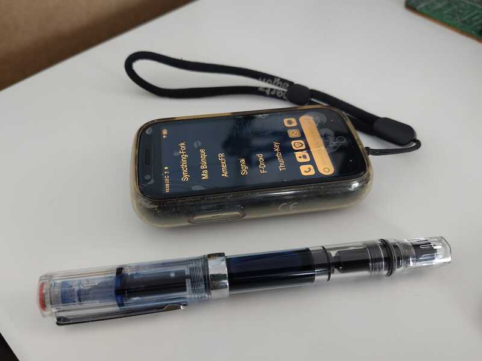
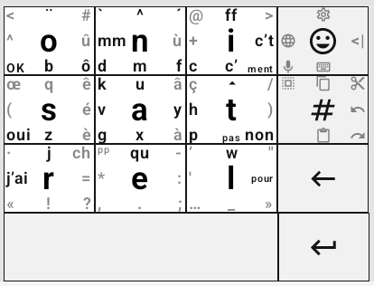
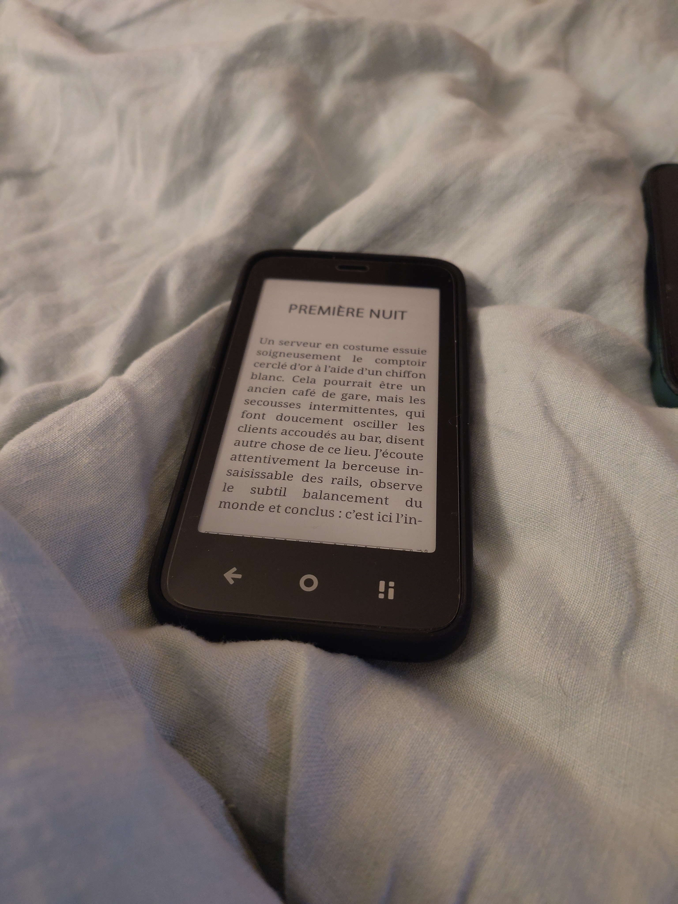
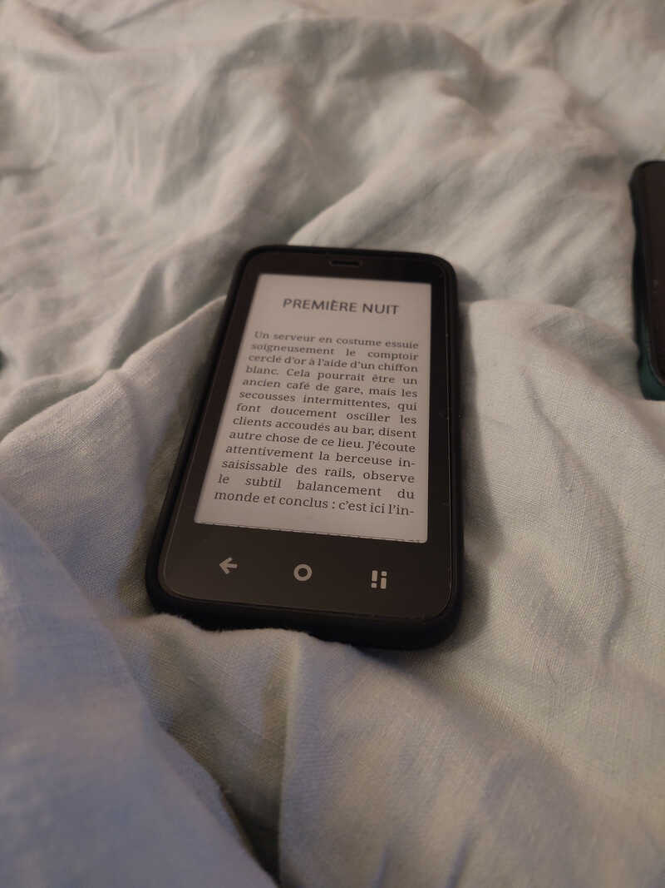
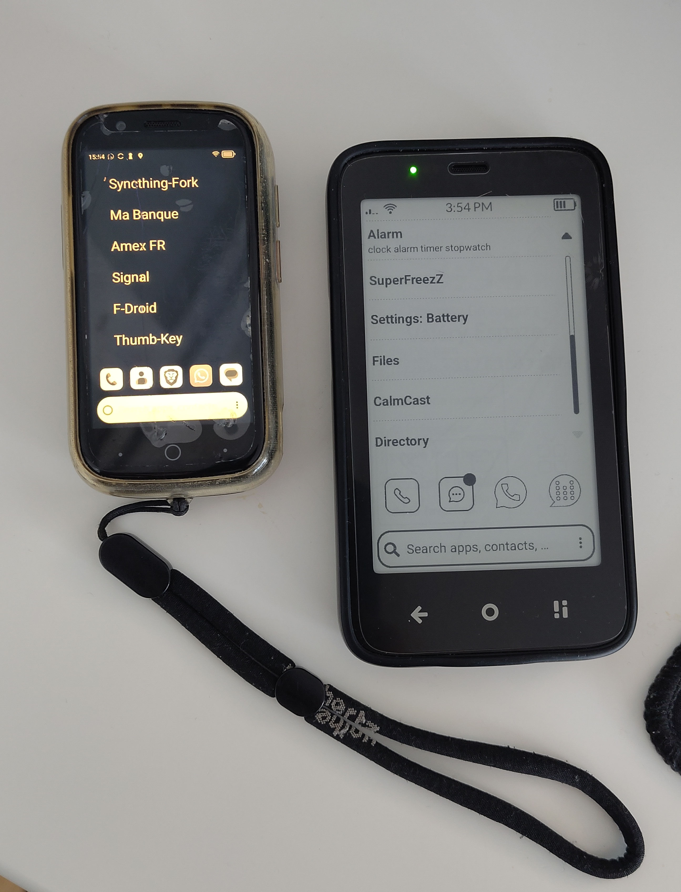
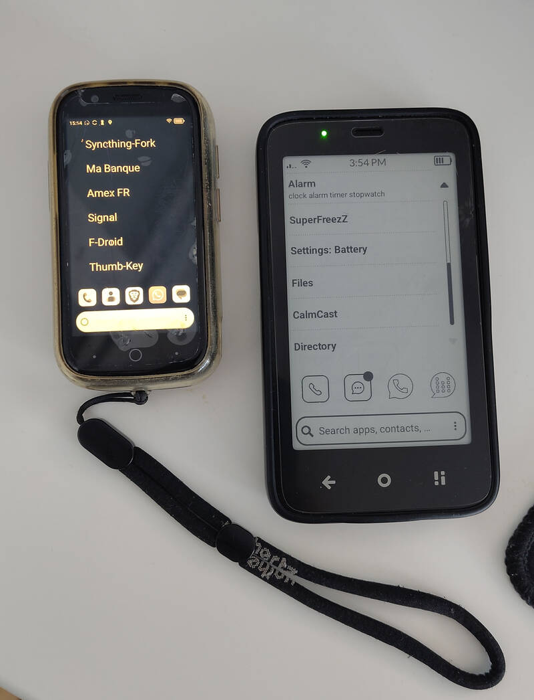

#+title: Dumbphones
#+author: Guillaume Coré (fridim)
#+options: num:nil toc:t
#+HTML_HEAD: <link rel="stylesheet" type="text/css" href="../../org.css"/>

Voici mon expérience avec les "dumbphones". Je mets des guillemets car il ne s'agit pas vraiment de dumbphones à proprement parler -- à part l'AGM M11 -- mais l'idée reste la même: la détox. Je mets également derrière ce terme:
- feature phone
- "dumbed down" smartphone. Exemple: un smartphone qu'on a configuré avec limite de temps via contrôle parental et en installant uniquement des applis avec UI minimalistes.
- boring phone
Trop de temps perdu à scroller sans but, trop de fois surpris à prendre en main mon tel pour aucune raison apparente. Bref, le pitch est un peu rechauffé et probablement évident aujourd'hui. On n'est pas tous égaux et certaines personnes vont très bien réussir à se réguler ou supprimer les applis superflues ou "toxiques" de leur smartphone. Ce n'est pas mon cas 😬.

Donc ça fait plusieurs mois que j'essaie une alternative plus radicale. Ça a commencé par l'achat d'un Jelly Star d'Unihertz début 2025 comme téléphone principal.

* Jelly Star (Unihertz)
Ce petit smartphone a été mon téléphone principal pendant 8 mois.

#+CAPTION: Moins de 10cm de long, affichant KISS launcher, en niveau de gris
#+NAME:   fig:jelly

⇒ [[https://www.unihertz.com/products/jelly-star][spécifications officielles]]
** Points forts
- L'écran est minuscule.

  => Évite les dérives du type "doomscrolling" (instagram etc).
  On a vraiment aucune envie de passer du temps dessus. On fait ce qu'on a à y faire, et on passe à autre chose. C'est beaucoup trop petit et contraignant pour avoir envie d'y passer plus de 30s. C'est encore plus vrai en mode grayscale.
  
- La camera 48MP. C'est pas du high end non plus, mais c'est laaargement suffisant et je dis pas ça seulement pour scanner des QR codes.
- Le format, great form factor.
  C'est très satisfaisant de sortir avec uniquement ce truc en poche. Les bords arrondis sont agreables à la prise en main.
- Bonnes performances. À part la taille et l'écran, niveau hardware c'est proche d'un smartphone standard.
- prise jack pour le son
- Compatible Google, Play Services, Play Store etc. Les applications bancaires fonctionnent !
  Il est aussi possible d'utiliser Uber par exemple. Tout est un peu laborieux mais rien d'impossible.
- NFC
** Points Faibles
- L'écran est minuscule.
  
  Surprise ! C'est pourtant *la* feature, mais c'est aussi le souci avec ce téléphone quand on l'envisage sur le long terme.
  Ça demande beaucoup de personnalisation pour que les menus soient lisibles, ou d'y augmenter la taille de la police dans les applis qui le permettent (WhatsApp et Signal gèrent ça). Pour les autres tanpis, car augmenter la police de façon globale amène d'autres problèmes qui sont encore plus difficiles à gérer: éléments visuels hors-écran, qu'on ne peut pas voir ni cliquer.
  
  Pour écrire, il faut absolument une clavier alternatif genre [[https://f-droid.org/en/packages/io.github.sspanak.tt9/][traditional-T9]] ou [[https://f-droid.org/en/packages/com.dessalines.thumbkey/][thumb-key]], dispos sur fdroid. Un truc classique genre gboard qwerty est trop petit c'est l'enfer.
  Le speech to text aide pas mal.
  
- Android 13 vieillissant
  
  Rien de rhédibitoire mais je ne crois pas qu'il y ait une MAJ vers un android plus récent prévue par Unihertz. Il y a [[https://www.reddit.com/r/unihertz/comments/16sviga/unihertz_jelly_star_running_great_with_lineageos/][des utilisateurs]] qui ont réussi à installer lineageos 20 dessus.

** Conclusion
Pour moi c'est un téléphone de *transition* et de détox. Je ne me vois pas le garder comme téléphone principal pour du long terme (8 mois c'était déjà pas mal…) En fait quand je lis un SMS, ou un message sur Signal, je ne suis pas en train de faire quelque chose de mal… et je ne veux pas me péter les yeux. Au départ, c'est un désavantage calculé mais qui devient trop pénible sur le long terme, surtout quand on n'a plus ses yeux de 20 ans.

Il coche beaucoup de cases quand même. On peut tout faire et on n'y passe pas trop de temps. Je dirais que si l'interface était mieux customisée pour sa taille, ça serait pas loin d'être parfait. Mais c'est pas la norme et les applis sont souvent très peu adaptées au format. Rien d'insurmontable mais ça va demander beaucoup trop d'investissement en temps à mon avis et c'est pas l'idée. On veut se désintéresser de l'objet, pas l'inverse.

J'avais aussi envie d'aller un peu plus loin. Avec ce tel, on est sur un smartphone déguisé. Ça fonctionne pour réduire le temps d'écran, le compromis est pragmatique. Mais ce n'est pas le changement que je veux voir opérer… puis je suis tombé sur:

⇒ [[https://mudita.com/community/blog/introducing-mudita-mindful-design/][Introducing Mudita Mindful Design]]

Alors j'ai tenté le coup et ai commandé le Mudita Kompakt.

* Mudita Kompakt

Premier constat avec le mudita kompakt: je trimbale maintenant deux téléphones au lieu d'un. Le kompakt et mon smartphone. Super 😅.
Difficile de me passer de mon smartphone dès le premier jour. Il s'agit davantage d'une transition et ça prend du temps.
Pour résumer, je dirais que pour chaque besoin ou utilisation, on a trois options:
- Faire autrement. C'est toujours le mieux et le plus satisfaisant, je trouve.
  Ex: prendre sa carte bleue ou du cash et non pas payer avec le NFC de son tel
- Utiliser le dumbphone…
- … ou smartphone de secours (via hotspot ou wifi)

Dans quelle categorie on tombe va dépendre des capacités du tel oubien de ce qu'on est prêt à sideloader dessus. J'essaie de trouver mon sweet spot et c'est pas si évident.

Un autre constat qui fait mal: c'est un rabbit hole. Trop de temps et d'énergie passés à essayer d'étudier les options matérielles, scruter les forums, configurer le téléphone, essayer d'installer manuellement tel ou tel APK, chercher des alternatives qui s'affichent correctement sur l'écran e-ink (y en a de plus en plus), et j'en passe. Je suis pas loin de faire un factory reset et de me servir du produit tel que Mudita l'a conçu, sans compromis. C'est surtout une attitude et des habitudes à changer.

Liste des modifications et applis que j'ai ajoutées manuellement (via APK, F-Droid ou Aurora)
- [[https://f-droid.org/packages/org.koreader.launcher.fdroid/][KOReader]] - l'application e-reader stock de Mudita est beaucoup moins bien que KOReader je trouve.
- [[https://f-droid.org/packages/com.android.gpstest.osmdroid/][GPSTest]] - Utile pour reset les données GPS quand on voyage
- keepass2android - Pour les mots de passe.  J'ai testé aussi [[https://github.com/Kunzisoft/KeePassDX][KeePassDX]], les deux fonctionnent bien. keepass2android est stable depuis des années alors j'ai pas vraiment vu l'intérêt de changer.
- WhatsApp - must have malheureusement. WhatsApp et Signal (molly) drainent la batterie très rapidement car il n'y a pas le Google Play Services Push Notifications, donc ça tourne en permanence pour checker s'il y a de nouveaux messages.
- [[https://molly.im/][Molly (Signal FOSS)]]
- [[https://f-droid.org/packages/org.decsync.cc/][DecSync CC]] - Pour synchroniser mes contacts en combo avec syncthing
- ProtonMail - Je ne l'utilise pas, mais ça peut dépanner.
- [[https://f-droid.org/packages/com.secuso.privacyFriendlyCodeScanner/][QR Scanner (PFA)]] - pour les QR codes
- [[https://f-droid.org/packages/com.aurora.store/][Aurora Store]] - pour installer certaines applications, sans avoir besoin d'un compte Google.
- [[https://f-droid.org/packages/com.orgzlyrevived/][Orgzly Revived]] - Mes notes et todo list synchronisé avec emacs via syncthing
- [[https://github.com/davidraywilson/CalmDirectory][CalmDirectory]] - Un annuaire. S'affiche très bien sur le mudita.
- [[https://f-droid.org/en/packages/com.wchung.qrshare/][qrshare]] - Pour générer un QR code.  (utilisé 1 fois, pratique mais pas indispensable)
- F-droid - pour la plupart des apps ajoutées
- [[https://f-droid.org/en/packages/com.donnnno.arcticons.light/][Arcticons]] - des icons qui s'affichent correctement sur l'écran e-ink
- Proton Calendar - parce que .. synchronisé
- [[https://github.com/davidraywilson/CalmCast][CalmCast]] - Pour les podcasts. Développé spécifiquement pour le Kompakt. Un must-have.
- [[https://f-droid.org/packages/superfreeze.tool.android/][superfreeze]] - Pour kill ou freeze les applications. Cela permet de garder une bonne autonomie de la batterie. Selon l'utilisation, je peux tenir 3 jours. En gardant whatsapp et Signal en background, c'est plutôt 24h.
  Perso je kill tout de temps en temps. J'accepte de ne pas recevoir les notifications WhatsApp ou Signal à cause de ça (on me SMS ou on m'appelle si c'est urgent).
- Mon [[https://github.com/fridim/KISS-eink][fork]] de KISS launcher
- [[https://f-droid.org/en/packages/info.plateaukao.einkbro/][einkbro]] - Navigateur e-ink-friendly
- [[https://f-droid.org/en/packages/org.shano.assistral/][assistral]] - Pour les interactions avec Mistral LeChat
- [[https://f-droid.org/en/packages/com.github.catfriend1.syncthingfork/][syncthingfork]] - syncthing pour synchroniser des fichiers avec le laptop
- [[https://f-droid.org/en/packages/com.dessalines.thumbkey][thumbkey]] - Clavier en partant de la disposition [[https://cisgressions.deuxfleurs.page/posts/thumbkey_frappefluide/][frappefluide]].
  
  En regardant la fréquence des lettres pour [[https://fr.wikipedia.org/wiki/Fr%C3%A9quence_d%27apparition_des_lettres][FR]]  et [[https://en.wikipedia.org/wiki/Letter_frequency][EN]]:
  - inverser le O et le U
  - inverser le E et le S. Le E juste au dessus de l'espace
  - virer les espaces insecables.. franchement on n'est pas là pour écrire un livre. Je les ai remplacés par ~oui~ et ~non~
  - virer ~ll~ et ~oo~  c'est hyper facile de double click sur une touche principale
  - virer ~[~ et ~]~ que je n'utilise pas et qui restent accessible en numérique. Les remplacer par le tréma et ~ff~
  - remplacer les guillemets à l'anglaise par ~j’ai~ et ~pour~
  - Tous les accents sur le haut de la touche key0_1
  - Déplacer ~ô~ sur la touche du O,  virer ~î~  et ~gh~. À la place:
    - "c’est " et "c’était " avec espace car ils ne finissent jamais une phrase.
    - ~ment~, courant en français.
  - Ajouter ~pour~, ~pas~ et ~OK~
  - Quelques raccourcis aller-retour (~swipeReturnText~):
    - sur ~mm~:  "même"
    - sur ~OK~:  "d’accord"
    - sur ~j’ai~:  "je suis " avec espace car on finit rarement par "je suis". Bon oui y a la phrase « Je pense, donc je suis » mais je ne vois pas d'autre exemple.
    
    
    #+CAPTION: le clavier thumb-key personnalisé
    #+NAME:   fig:thumbkey
    
  
    => [[file:thumb-key_modify_keys.yaml][yaml config]] à insérer dans thumb-key directement

J'adhère complétement à ce que Mudita essaye de faire, notamment avec le Mudita Mindful Design (MDD). Quand on utilise les applications stock mudita, on se rend compte à quel point tout le reste de +l'industrie du tabac+ des géants de la tech est complétement fucké.
Toutes les applications preinstallées avec le téléphone respectent ces règles d'UI et design. Et c'est vrai qu'elles sont agréables. On voit même maintenant de plus en plus d'applications sur ces principes venant de la communauté:
- [[https://github.com/gezimos/inkOS][inkOS]]
- [[https://github.com/davidraywilson/CalmDirectory][CalmDirectory]]
- [[https://github.com/davidraywilson/CalmCast][CalmCast]]
- [[https://github.com/lamdanAmiti/InkMessage][InkMessage]]
- [[https://github.com/fridim/KISS-eink][KISS-eink]]

Le dernier est un fork de [[https://kisslauncher.com/][KISS]] que j'ai fait et que j'utilise sur le Mudita Kompakt.
  
** Points forts
- L'écran e-ink

  J'adore cet écran. La résolution pourrait être meilleure, mais pour du texte c'est amplement suffisant. Sans parler du fait qu'en pleine lumière du jour, on y voit parfaitement. En terrasse à 13h, plein cagnard, c'est encore plus lisible.
  Pour quand il fait sombre, il y a un rétro éclairage ajustable. Je le mets soit au minimum en soirée / voiture, soit éteint la journée.
  Avec [[https://f-droid.org/en/packages/org.koreader.launcher.fdroid/][KOReader]], je m'en sers aussi comme liseuse. Ça tient dans la main et on peut touner les pages avec les boutons volume +/-.
  
  #+CAPTION: lecture d'EPUB sur KOReader ()
  #+NAME:   fig:jellykompakt
  

- switch physique "offline"
  
  Très cool. On pourrait penser que c'est gadget, que ça revient à se mettre en mode avion. Mais pas tout à fait. Ça éteint tous les connexions sans fil: cellulaire, wifi, bluetooth, … satisfaisant juste avant de se coucher, car très accessible: on n'est pas obligé d'allumer et de regarder le tel. Peut-être un peu trop accessible d'ailleurs car ça m'est arrivé une fois ou deux de l'activer involontairement dans la poche.

- Fabriqué en Europe
  Entreprise polonaise, ça compte aussi.

- Sans Google. Pas de Play Store, pas de compte google
  C'est ce que je voulais, mais je comprends que ça peut être vu comme un point négatif.

- Possibilité de sideloader des applications (APK, ou via F-droid, aurora store)

- Communauté active, SAV
  
  Mudita écoute les retours de ses utilisateurs et livre des mises à jour qui améliorent la partie software. Ils ne disent pas oui à tout, mais le fait qu'ils continuent d'améliorer et stabiliser leur produit est rassurant. Ils ne sont pas pressés et l'intention est là.

  ⇒ [[https://forum.mudita.com/][Mudita forum]]
  
  
** Points faibles
- Prix.
- Manque de performance dès qu'on sort des applications Mudita supportées.
- Camera.
  Suffira pour scaner un QR code.
- L'application Calendar préinstallée. 😠
  Local uniquement, pas de synchronisation.
  Elle n'utilise pas la DB par défaut d'android et n'est donc pas synchronisable avec quelque chose comme [[https://f-droid.org/packages/org.decsync.cc/][DecSync CC]]. J'utilise proton calendar en attendant, mais ce n'est pas du tout optimisé pour l'écran e-ink. Je ne comprends vraiment pas ce choix de Mudita. Je veux de la synchronisation pour le calendrier car je veux passer *moins* de temps sur mon écran. Si je reçois une invitation calendrier (.ics par exemple) par email, je veux pouvoir accepter l'invitation directement et que ce soit automatiquement synchronisé sur le téléphone. Imaginer devoir l'entrer manuellement à chaque fois? Non merci.
  Bon cela dit, je crois que la synchro est prévue dans la roadmap de Mudita.

#+CAPTION: Le Jelly Star et Mudita Kompakt côte à côte présentant respectivement les launchers KISS et KISS-eink ()
#+NAME:   fig:jellykompakt

* Conclusion

Ce qui fait chier dans tout ça c'est qu'on se retrouve à claquer $300 voire plus pour avoir *moins* de feature.
C'est encore hyper niche et les produits sont faits par des petites équipes: Minimal Phone, Mudita Kompakt, Light phone… et coûtent *une blinde*.
Le light phone III serait le dumbphone idéal s'il était pricé à $50. Pas $699. Non mais sérieux, $700 ?

On est tellement habitué à chercher à résoudre un problème par une approche consumériste qu'on en oublierait l'essentiel.

Mais pour conclure, après presque un an sur le sujet, je n'ai aucune envie de revenir en arrière, au contraire. J'y vois plus clair sur ce que je ne veux plus tolérer et laisser entrer dans mon quotidien.

Je regrette qu'il n'y ait pas plus de standards en place pour les feature phones. On pourrait simplement avoir quelque chose à 30€ et qui nous ramenerait pas 20 ans en arrière. En parlant de standard, il y a [[https://developer.cloudphone.tech/][cloudphone]] qui a l'air intéressant. Ça permet de transformer le tel en simple terminal thin client-web et garder la partie compliquée sur les serveurs. Avec ce genre de norme, on pourrait avoir certaines applications utiles (transport public, annuraire, maps, …) sur des tels hyper bons marchés.
L'AGM M11 qui va sortir fin janvier est compatible Cloud Phone (nom de merde soit dit en passant), on verra bien si ça prend en Europe.

Pour finir quelques liens:
- [[https://www.dumbphones.org/][dumbphones.org]] 
- [[https://www.reddit.com/r/dumbphones/][Reddit r/dumbphones]]

