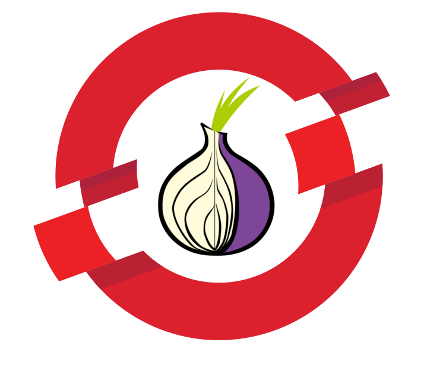
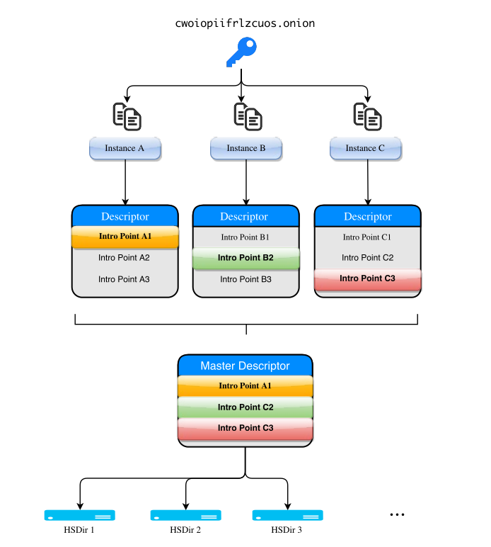
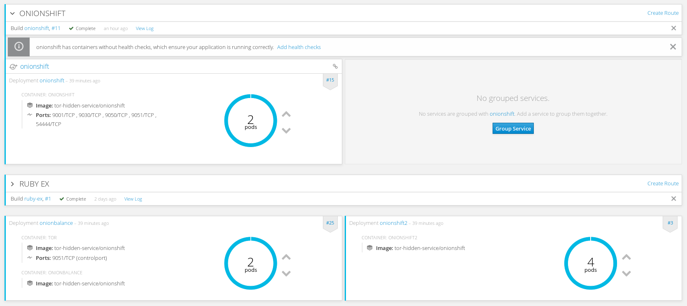
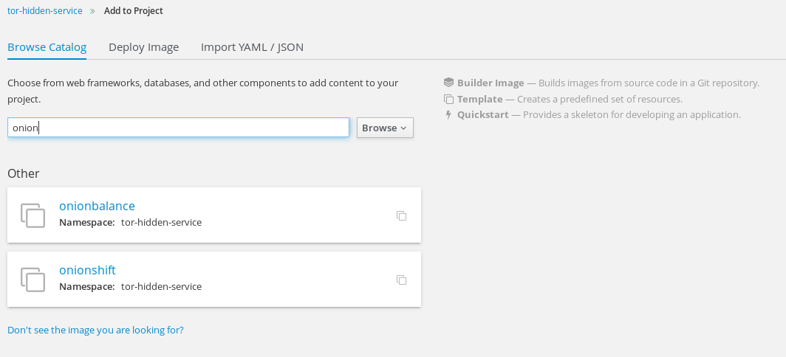
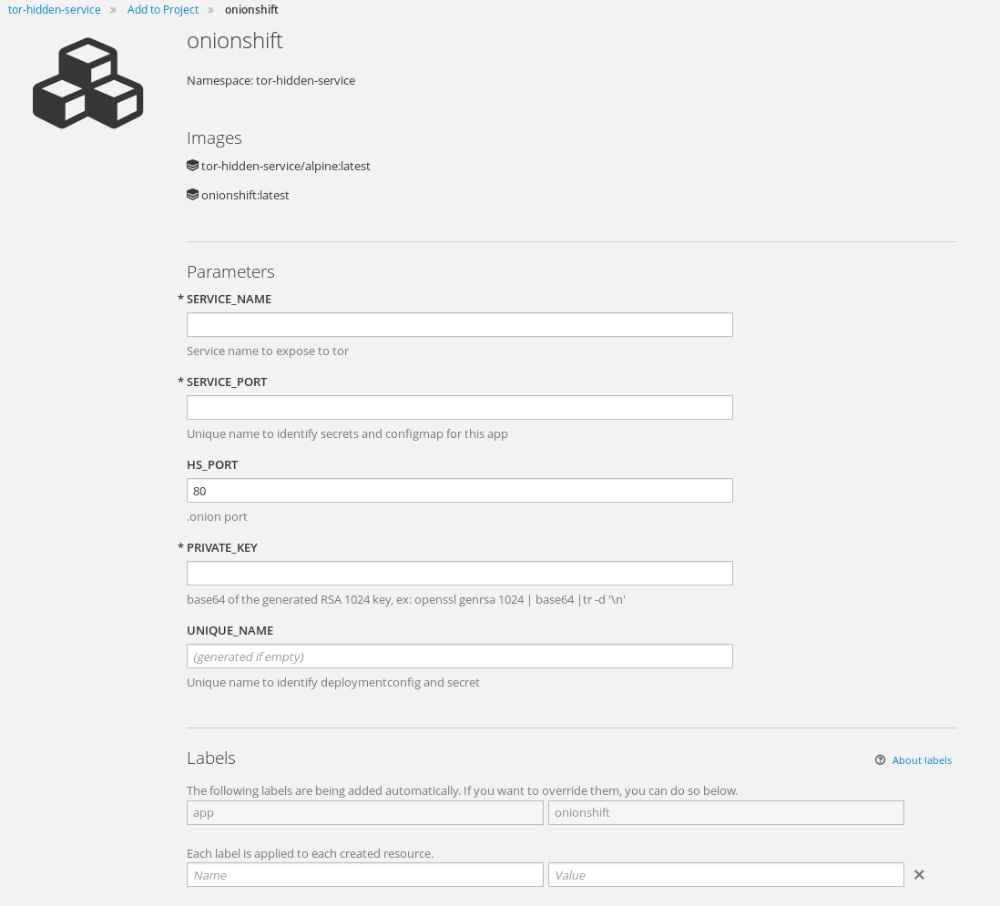

# Tor hidden service on Openshift 3
<small>2016-10-04 ~ #openshift #tor</small>

Table of content:

%%TOC%%

---

**TL;DR ?**

* GO [THERE](#tldr2) for Openshift templates to quickly do the job for both tor and onionbalance
* GO [THERE](#tldr) for one-line command to quickly expose an openshift service on tor.

---

So i asked myself :

* How to simply expose your Openshift app via Tor ?
* How hard would it be ?
* Would it scale ?

Why ?

* for fun
* your app audience needs a tor .onion access (journalists, ...)
* use Tor as an alternative mean to expose your Openshift App. Thanks to HiddenServiceAuthorizeClient option, you can even expose it to only specific users.
* Why not take advantage of Openshift scalability and HA to host Tor hidden services ?

If your goal is really security, you have to make sure the underlying platform (Openshift) and infrastructure (cloud provider or Baremetal) are trustworthy.

Here the logic diagram of what i'll try to accomplish :

Some observations:

* to get a single .onion address for a service is easy, see [official doc](https://www.torproject.org/docs/tor-hidden-service.html.en)
* (kindof) load-balancing is possible by creating 2 or more tor instances sharing the same private_key
* to load-balance  over several .onion you need an additional daemon, [onionbalance](http://onionbalance.readthedocs.io/en/latest/index.html)

In this schema, the Tor pods serve different .onion hostname, so you'll have to communicate those addresses to the users.

**Unless** you setup an additional tool: [onionbalance](http://onionbalance.readthedocs.io/en/latest/index.html). It is possible to loadbalance tor .onion but it requires onionbalance, which acts as a kind of DNS round robin but for Tor:

In this post, i'll describe all the steps i've been through. I'll start with a simple one-instance tor .onion. Then try onionbalance and see how it can be "Openshiftized". The ideal would be to be able to scale up and down tor pods and have the onionbalance pod updated automatically.
At the end, i'll try to summarize everything into a template.

## The Application

In this exercise i do not care about the app at all, so i just run :

    oc new-app centos/ruby-22-centos7~https://github.com/openshift/ruby-ex.git

It creates pods and a <code>ruby-ex</code> service i'll route later via Tor.

## Expose your app on Tor and get your .onion
### Tor HiddenServicePort
To be able to reach your app via a .onion URL, server-side you'll need a tor daemon (client mode) running
with an hidden service configured pointing to your openshift service.

I searched if there was any existing Docker image for tor (of course there is one..) and found this [Dockerfile](https://github.com/chriswayg/tor-alpine).

It compiles tor on [Alpine](http://www.alpinelinux.org/), which is tiny (4.795MB), secure, etc. It sounds like a good plan.

So i forked this repo, removed all the unecessary stuff, added other stuff, like rsync to be able to use <code>oc rsync</code>. My idea was: Everything that will be handled by openshift can be moved out so the image is agnostic.

Here is the result : <https://github.com/fridim/onionshift>

### one-line command to expose a service

    ::::bash
    oc new-app https://github.com/fridim/onionshift -e SERVICE_NAME=ruby-ex,SERVICE_PORT=8080

This will create everything (deployment config, buildconfig, ...) and pod will have a simple torrc based on the [template](https://github.com/fridim/onionshift/blob/master/torrc.template) in the repository. It's dead simple, and if you want to add a more complex tor configuration, you can use configMap (see [bellow](#configmap)).

You should see the docker build and the final push to the registry. Then a pod onionshift-... should be running.

Tor will create a private\_key and hostname in the directory specified by <code>HiddenServiceDir</code>.

Check the logs :

    $ oc logs tor-7-buxlt
    + cd /data
    + export SERVICE_NAME=ruby-ex
    + SERVICE_NAME=ruby-ex
    + export SERVICE_PORT=8080
    + SERVICE_PORT=8080
    + export HS_PORT=80
    + HS_PORT=80
    + '[' '!' -e /etc/tor/torrc ']'
    + envsubst
    + /usr/bin/tor -f torrc
    Sep 29 13:05:40.101 [notice] Tor v0.2.8.7 running on Linux with Libevent 2.0.22-stable, OpenSSL 1.0.2j and Zlib 1.2.8.
    Sep 29 13:05:40.101 [notice] Tor can't help you if you use it wrong! Learn how to be safe at https://www.torproject.org/download/download#warning
    Sep 29 13:05:40.101 [notice] Read configuration file "/data/torrc".
    Sep 29 13:05:40.107 [notice] Wow!  I detected that you have 24 CPUs. I will not autodetect any more than 16, though.  If you want to configure more, set NumCPUs in your torrc
    Sep 29 13:05:40.107 [notice] Opening Socks listener on 127.0.0.1:9050
    Sep 29 13:05:40.000 [notice] Parsing GEOIP IPv4 file //share/tor/geoip.
    Sep 29 13:05:40.000 [notice] Parsing GEOIP IPv6 file //share/tor/geoip6.
    Sep 29 13:05:40.000 [notice] Bootstrapped 0%: Starting
    Sep 29 13:05:41.000 [notice] Bootstrapped 5%: Connecting to directory server
    Sep 29 13:05:41.000 [notice] Bootstrapped 10%: Finishing handshake with directory server
    Sep 29 13:05:41.000 [notice] Bootstrapped 15%: Establishing an encrypted directory connection
    Sep 29 13:05:41.000 [notice] Bootstrapped 20%: Asking for networkstatus consensus
    Sep 29 13:05:41.000 [notice] Bootstrapped 25%: Loading networkstatus consensus
    Sep 29 13:05:41.000 [notice] I learned some more directory information, but not enough to build a circuit: We have no usable consensus.
    Sep 29 13:05:41.000 [notice] Bootstrapped 40%: Loading authority key certs
    Sep 29 13:05:41.000 [notice] Bootstrapped 45%: Asking for relay descriptors
    Sep 29 13:05:41.000 [notice] I learned some more directory information, but not enough to build a circuit: We need more microdescriptors: we have 0/7187, and can only build 0% of likely paths. (We have 0% of guards bw, 0% of midpoint bw, and 0% of exit bw = 0% of path bw.)
    Sep 29 13:05:41.000 [notice] Bootstrapped 50%: Loading relay descriptors
    Sep 29 13:05:42.000 [notice] Bootstrapped 56%: Loading relay descriptors
    Sep 29 13:05:42.000 [notice] Bootstrapped 62%: Loading relay descriptors
    Sep 29 13:05:42.000 [notice] Bootstrapped 67%: Loading relay descriptors
    Sep 29 13:05:42.000 [notice] Bootstrapped 75%: Loading relay descriptors
    Sep 29 13:05:42.000 [notice] Bootstrapped 80%: Connecting to the Tor network
    Sep 29 13:05:42.000 [notice] Bootstrapped 90%: Establishing a Tor circuit
    Sep 29 13:05:43.000 [notice] Tor has successfully opened a circuit. Looks like client functionality is working.
    Sep 29 13:05:43.000 [notice] Bootstrapped 100%: Done

Grab the .onion address:

    $ oc exec tor-7-buxlt cat /data/tor/hidden_service/hostname
    siojz6ucairjccsu.onion

Test it in tor-browser :)

This address will disapear as soon as the pod is deleted.
If you want to be able to reuse the same .onion address over and over across pod creations, you'll need to store it somewhere (mount secrets inside pods, or add persistent volume).

### Tor Configuration

If you're happy with the torrc generated from the [template](https://github.com/fridim/onionshift/blob/master/torrc.template), you can skip this section.

There is a lot of options to control the tor daemon. You will find a complete example of torrc [here](https://gitweb.torproject.org/tor.git/plain/src/config/torrc.sample.in).

Regarding how to put it inside pods, if you take the example of postgresql image for Openshift, the configuration is generated at runtime from env variables :

* [postgresql-container/Dockerfile · sclorg/postgresql-container · GitHub](https://github.com/sclorg/postgresql-container/blob/master/9.5/root/usr/bin/run-postgresql)

I'm not going to add every option avaible in torrc as an env variable. I only added a few to be able to quickly expose any service to tor with one command, but that's it.

A simpler way is to use configMap and mount it to <code>/etc/tor/torrc</code>.

#### configMap

> Many applications require configuration via some combination of config files, command line arguments, and environment variables. These configuration artifacts should be decoupled from image content in order to keep containerized applications portable. The ConfigMap API resource provides mechanisms to inject containers with configuration data while keeping containers agnostic of Kubernetes. ConfigMap can be used to store fine-grained information like individual properties or coarse-grained information like entire config files or JSON blobs.

So first create a torrc configuration file. We'll use the app service name for the <code>hiddenServicePort</code> value :

    ::::bash
    ### /etc/torrc ###
    # https://www.torproject.org/docs/tor-manual.html.en
    # CONFIGURE THIS BEFORE RUNNING TOR!
    DataDirectory /data/tor

    HiddenServiceDir /data/tor/hidden_service/
    HiddenServicePort 80 ruby-ex:8080

Add this file to the project as a configMap:

    oc create configmap torrc \
    --from-file=torrc

Check if it's OK, mine looks like this:

    ::::yaml
    [fridim@master onionshift]$ oc get configmap -o yaml
    apiVersion: v1
    items:
    - apiVersion: v1
      data:
        torrc: |
          ### /etc/torrc ###
          # https://www.torproject.org/docs/tor-manual.html.en

          # CONFIGURE THIS BEFORE RUNNING TOR!

          DataDirectory /data/tor

          HiddenServiceDir /data/tor/hidden_service/
          HiddenServicePort 80 ruby-ex:8080
      kind: ConfigMap
      metadata:
        creationTimestamp: 2016-09-22T16:10:50Z
        name: torrc
        namespace: tor-hidden-service
        resourceVersion: "1419464"
        selfLink: /api/v1/namespaces/tor-hidden-service/configmaps/torrc
        uid: 2129fb99-80df-11e6-a17e-ac162d7c2550
    kind: List
    metadata: {}

Then add a volume from this configMap :

    oc volume dc/onionshift --add --type=configMap --configmap-name=torrc -m /etc/tor

DeploymentConfig update triggers re-deployment and creates a new pod with the new torrc conf.

### Persistent .onion
Before you setup onionbalance, let's have persistent .onion address, aka keep the same private\_key of your hidden service accross pod creations.

The first time you run tor it creates hidden_service directory and generates private\_key.

Backup the private_key and hostname using rsync:

    ::::bash
    fridim@master ~]$ mkdir hidden_service
    [fridim@master ~]$ oc rsync onionshift-21-eqsrq:/data/tor/hidden_service/ hidden_service/
    receiving incremental file list
    ./
    hostname
    private_key

    sent 68 bytes  received 1074 bytes  761.33 bytes/sec
    total size is 910  speedup is 0.80

Create a secret with the private key :

    ::::bash
    [fridim@master hidden_service]$ oc create secret generic privatekey --from-file=privatekey=./private_key
    secret "privatekey" created

(You need to specify the secret name as you can't have underscore in the name)

Now mount this private\_key to be used at runtime. We cannot mount it directly to the final destination <code>/data/tor/hidden\_service/private\_key</code> because it would have root ownership when tor is run as a user and will then complain that ownership is not correct. To bypass this, [tor-entrypoint.sh](https://github.com/fridim/onionshift/blob/master/tor-entrypoint.sh) imports the key found in <code>/data/import</code> into <code>/data/tor/hidden\_service/private\_key</code>.

So mount the privatekey secret into <code>/data/import</code> :

    oc volume dc/onionshift --add --mount-path=/data/import --secret-name=privatekey

[tor-entrypoint.sh](https://github.com/fridim/onionshift/blob/master/tor-entrypoint.sh) will move the key to <code>/data/tor/hidden\_service/private\_key</code> so you can let the filename in import/ be the secret name (you don't need to edit the deployment config to set <code>.secret.items[].path</code> to <code>private\_key</code>).

There you go, .onion address will last across pod deletion/creation.

You can scale UP the pod number of replicas, tor daemons will share the same key and clients will be dispatched randomly to tor instances (not equally, see this [paper](https://www.benthamsgaze.org/wp-content/uploads/2015/11/sucu-torscaling.pdf)).

    oc scale --replicas=2 dc onionshift

You can go up to 6 I think.

## Scalability with onionbalance
### Create more tor instances
For now we have one persistent .onion with several tor instances registering to HSDir at different moments, so clients are load-balanced to those pods.

Let's create another bunch of tor pod with another key in order to use onionbalance. For that, just  edit the current deploymentConfig

    oc edit dc

* Duplicate the section of onionshift.
* Rename the pod and deploymenconfig.
* Remove the volumes as we didn't create the privatekey yet.

Example:

    ::::yaml
    ---
    apiVersion: v1
    kind: DeploymentConfig
    metadata:
      annotations:
        openshift.io/generated-by: OpenShiftNewApp
      labels:
        app: onionshift
      name: onionshift2
    spec:
      strategy:
        type: Rolling
      replicas: 2
      selector:
        app: onionshift
        deploymentconfig: onionshift2
      template:
        metadata:
          annotations:
            openshift.io/generated-by: Hand
          creationTimestamp: null
          labels:
            app: onionshift
            deploymentconfig: onionshift2
        spec:
          containers:
          - env:
            - name: SERVICE_NAME
              value: ruby-ex
            - name: SERVICE_PORT
              value: "8080"
            image: onionshift:latest
            imagePullPolicy: Always
            name: onionshift2
            terminationMessagePath: /dev/termination-log
            volumeMounts:
            #- mountPath: /data/import
            #  name: volume-eg9ol
          dnsPolicy: ClusterFirst
          restartPolicy: Always
          securityContext: {}
          terminationGracePeriodSeconds: 30
          volumes:
          #- name: volume-eg9ol
            #secret:
              #secretName: privatekey
      triggers:
      - type: ConfigChange
      - imageChangeParams:
          automatic: true
          containerNames:
          - onionshift2
          from:
            kind: ImageStreamTag
            name: onionshift:latest
        type: ImageChange

rsync the key of one of the pod :

    oc rsync onionshift2-1-l2676://data/tor/hidden_service/ hidden_service/
    receiving incremental file list
    hostname
    private_key

    sent 79 bytes  received 1071 bytes  766.67 bytes/sec
    total size is 910  speedup is 0.79
    [fridim@master ~]$ cd hidden_service/
    [fridim@master hidden_service]$ oc create secret generic privatekey2 --from-file=privatekey=./private_key
    secret "privatekey2" created

Mount the secret in /data/import :

    oc volume dc/onionshift2 --add --mount-path=/data/import --secret-name=privatekey2

### configure onionbalance daemon

So now we have different .onion and different tor instances each one with its own private_key. Let's see how we can setup a load-balanced .onion.

2 components :

* tor with ControlPort and CookieAuthentication
* onionbalance

This time, the [configuration](http://onionbalance.readthedocs.io/en/latest/getting-started.html) is:

    DataDirectory /data/tor

    ControlPort 9051
    CookieAuthentication 1
    CookieAuthFile /data/shared/control_auth_cookie
    SocksPort 0

Do not keep this option from the onionbalance documentation :

    <code>RunAsDaemon 1</code>

Otherwise the container will exit as soon as tor tries to daemonize.

<code>CookieAuthFile /data/shared/control_auth_cookie</code> is to place the shared cookie in a shared volume (**emptyDir**) between containers of the pod. We cannot just mount emptyDir volume to <code>/data/tor</code> directly because ownership would then be root:USER and tor does not allow uid of file to be different from the user running tor. For information why permission and ownership are handled the way they are in emptyDir: see [this kubernetes issue](https://github.com/kubernetes/kubernetes/issues/2630).

Create a configMap from this configuration :

    oc create configmap torrc-balance --from-file torrc-balance

#### Generate master private\_key

The only hidden service private\_key we'll need to keep is actually the one from the master. All other tor hidden\_service that are load-balanced by this one can be ephemeral and can be changed in onionbalance <code>master.conf</code>.

If you have access to docker:

    ::::bash
    git clone https://github.com/fridim/onionshift
    cd onionshift
    docker build -t fridim/onionshift .
    docker run fridim/onionshift /bin/sh -c 'cd /tmp && /usr/bin/onionbalance-config -n 0 && ls config/master/*key && cat config/master/*key'

This will output a new RSA key and its .onion associated, to use with the tor instance and onionbalance.

If you do not need to know the .onion yet, you can simply run:

    openssl genrsa 1024 > private.key

Save the key and create the secret, ex :

    oc create secret generic bl2eo4cvuyrcd47v.key --from-file=./bl2eo4cvuyrcd47v.key

List the .onion to be load-balanced, for example :

    $ oc get pods --selector=app=onionshift --no-headers=true |cut -f1 -d' '|xargs -n1 -I{} oc exec {} cat /data/tor/hidden_service/hostname
    jwe3ybar7layfbhc.onion
    akz77e4fe6c5iwbf.onion

(you may need to adapt this depending on your names, labels, ...)

create onionbalance config.yaml :

    ::::yaml
    TOR_ADDRESS: 127.0.0.1
    TOR_PORT: 9051
    STATUS_SOCKET_LOCATION: /data/onionbalance/control
    services:
    - instances:
      - address: jwe3ybar7layfbhc.onion
      - address: akz77e4fe6c5iwbf.onion
      key: bl2eo4cvuyrcd47v.key

Create the configmap from it :

    oc create configmap bl2eo4cvuyrcd47v.conf --from-file=./bl2eo4cvuyrcd47v.conf

This configmap will have to be updated everytime you want to add or remove a .onion backend.

Since we need a tor daemon AND an onionbalance daemon, we'll need 2 containers for this pod.

Let's create a new pod for those 2 :

    ::::yaml
    - apiVersion: v1
      kind: DeploymentConfig
      metadata:
        name: onionbalance-8mv1fjcxc8
      spec:
        replicas: 1
        template:
          metadata:
            labels:
              app: onionbalance
            name: onionbalance
          spec:
            containers:
            - image: onionshift:latest
              name: tor
              ports:
              - containerPort: 9051
                name: controlport
              volumeMounts:
              - mountPath: /etc/tor
                name: torrc
              - mountPath: /data/shared
                name: volume-data-tor
            - command:
              - /onionbalance-entrypoint.sh
              image: onionshift:latest
              name: onionbalance
              volumeMounts:
              - mountPath: /data/shared
                name: volume-data-tor
              - mountPath: /data/import-key
                name: masterkey
              - mountPath: /data/import-conf
                name: masterconf
            volumes:
            - emptyDir: null
              name: volume-data-tor
            - configMap:
                name: onionbalance-torrc
              name: torrc
            - name: masterkey
              secret:
                secretName: bl2eo4cvuyrcd47v.key
            - configMap:
                items:
                - key: bl2eo4cvuyrcd47v.conf
                  path: config.yaml
                name: bl2eo4cvuyrcd47v.conf
              name: masterconf
        triggers:
        - type: ConfigChange
        - imageChangeParams:
            automatic: true
            containerNames:
            - tor
            from:
              kind: ImageStreamTag
              name: onionshift:latest
          type: ImageChange
        - imageChangeParams:
            automatic: true
            containerNames:
            - onionbalance
            from:
              kind: ImageStreamTag
              name: onionshift:latest
          type: ImageChange

(all those objects, secret, configmap, deploymentconfig, ..., are generated by the [templates](#tldr2))

I create one imageChange  trigger for each container because when i tried with one imageChange that has 2 containers in <code>containerNames</code> it was not updating the image properly after build is done. I don't know why the containerNames array is not iterated over.

I filled a bug about it : <a href="https://bugzilla.redhat.com/show_bug.cgi?id=1381833">bugzilla.redhat.com/1381833</a>

#### onionbalance status socket

onionbalance create a status socket, if you want to check its content :

    oc rsh -c onionbalance onionbalance-..
    / $ socat - unix-connect:/data/onionbalance/control
    bl2eo4cvuyrcd47v.onion 2016-10-03 15:15:17
      hbvlni32fc32v7zw.onion 2016-10-03 15:00:00 3 IPs
      6bztlzyrm7lhzy2g.onion [offline]

This was a sec after starting. After a while :

    / $  socat - unix-connect:/data/onionbalance/control
    bl2eo4cvuyrcd47v.onion 2016-10-03 15:15:17
      hbvlni32fc32v7zw.onion 2016-10-03 15:00:00 3 IPs
      6bztlzyrm7lhzy2g.onion 2016-10-03 15:00:00 3 IPs

To simply see the logs when a pod has several containers, you need to add the <code>-c CONTAINER</code> option. Example:

    [fridim@master hidden_service]$ oc logs -c onionbalance onionbalance-25-28vs3
    + TIMEOUT=500
    + cd /data
    + mkdir -p onionbalance tor
    + '[' -d import-key ']'
    + cp import-key/bl2eo4cvuyrcd47v.key onionbalance/
    + cp import-conf/config.yaml onionbalance/
    + '[' -d /data/shared ']'
    + export -f wait_and_copy_cookie
    + timeout -t 500 bash -c wait_and_copy_cookie
    + cd /data/onionbalance
    + /usr/bin/onionbalance -c config.yaml
    2016-10-03 15:14:26,947 [INFO]: Loaded the config file '/data/onionbalance/config.yaml'.
    2016-10-03 15:14:26,958 [INFO]: Loaded 2 instances for service bl2eo4cvuyrcd47v.onion.
    2016-10-03 15:14:26,960 [INFO]: Initiating fetch of descriptors for all service instances.
    2016-10-03 15:14:32,247 [INFO]: The introduction point set has changed for instance hbvlni32fc32v7zw.onion.
    2016-10-03 15:15:17,013 [INFO]: No descriptor received for instance 6bztlzyrm7lhzy2g.onion yet.
    2016-10-03 15:15:17,179 [INFO]: Published a descriptor for service bl2eo4cvuyrcd47v.onion under replica 0.
    2016-10-03 15:15:17,364 [INFO]: Published a descriptor for service bl2eo4cvuyrcd47v.onion under replica 1.
    2016-10-03 15:16:32,080 [INFO]: The introduction point set has changed for instance 6bztlzyrm7lhzy2g.onion.
    2016-10-03 15:20:18,328 [INFO]: Published a descriptor for service bl2eo4cvuyrcd47v.onion under replica 0.
    2016-10-03 15:20:18,979 [INFO]: Published a descriptor for service bl2eo4cvuyrcd47v.onion under replica 1.

### scale up onionbalance

Just run :

    oc scale --replicas=2 dc onionbalance

Or use the web console:

## Templates
To resume all the previous steps in an handy way, i created two templates to easily deploy onionshift or onionbalance.

### onionshift
add the template to your namespace:

    oc create -f https://raw.githubusercontent.com/fridim/onionshift/master/templates/onionshift.yaml

Then use command line <code>oc</code> to process the template or web console :

### onionbalance

 Input is :

* private key
* list of .onion to loadbalance

It will create secret, deploymentconfig, configmap, buildconfig, imagestream, etc, for you. Just import it to your project:

    oc create -f https://raw.githubusercontent.com/fridim/onionshift/master/templates/onionbalance.yaml

You can process it and run it from the command-line with <code>oc</code> or from the webconsole :

## Monitor tor daemon with arm

[arm](https://www.atagar.com/arm/) is installed in the image. Just add the ControlPort in your torrc if you want to use it. Then, something like :

    $ oc rsh onionshift-...
    cd /data/
    echo "ControlPort 9051" >> torrc
    pkill -sighup tor
    HOME=/data arm

Should do the trick and get you info about. I don't have traffic at all but here an example:

# Links

* <https://github.com/fridim/onionshift>
* [Hidden Services need some love | The Tor Blog](https://blog.torproject.org/blog/hidden-services-need-some-love)    Original post rising the scalability issues
* [Cooking with Onions](https://blog.torproject.org/blog/cooking-onions-finding-onionbalance)
* [tor hidden service scaling](https://www.benthamsgaze.org/wp-content/uploads/2015/11/sucu-torscaling.pdf)   Nice paper
* [onionbalance documentation](http://onionbalance.readthedocs.io/en/latest/index.html)
* [Volumes are created in container with root ownership and strict permissions](https://github.com/kubernetes/kubernetes/issues/2630).

# Ideas and TODOs

Please consider this whole post as work in progress:

* <del>Add a TL;DR for how to quickly add .onion for your app (in a nutshell)</del>
* find out a more dynamic way to add/remove backend in onionbalance
* add livenessprobe check
* would it be possible to implement this as a route in Openshift?
* <del>write a template</del>
* <del>add</del> [arm](https://www.atagar.com/arm/) <del>to the image, to be able to see what's happening at the tor level</del>
* add a section about  HiddenServiceAuthorizeClient  to allow your hidden service only to specific users
* <del>tor-entrypoint.sh : import private_key if present in /data</del>
* <del>tor-alpine: rename project and add a proper README.md</del>
* create another Dockerfile (repository?) for onionbalance
